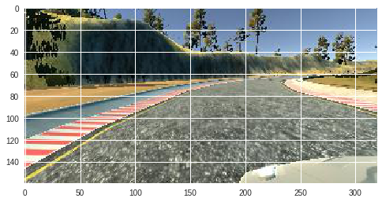

# **Behavioral Cloning** 

**Behavioral Cloning Project**

The goals / steps of this project are the following:
* Use the simulator to collect data of good driving behavior
* Build, a convolution neural network in Keras that predicts steering angles from images
* Train and validate the model with a training and validation set
* Test that the model successfully drives around track one without leaving the road
* Summarize the results with a written report

## Rubric Points

### Are all required files submitted?
Files submitted:

* model.h5
* drive.py
* model.py
* video_track1.mp4
* video_track2.mp4

### About the code
The model `model.h5` should work  to drive automously the car inside the simulator.

The code was used inside a Jupyter Notebook in Colab (https://colab.research.google.com/notebooks/
The data was stored in Google Drive. For each data collection, a csv and a zip with all the images was stored in Google Drive. The first part of the code connects to Google Drive and downloads locally the files so they can be used fast with Colab's GPU.

 ### Model Architecture and Training Strategy

 #### About the model
The model used was made of the following layers:

* Lambda layer to normalize input (x / 127.5) - 1
* Cropping layer to ignore upper and lower parts of the image(cropping=((75,15), (0,0))
* Convoluted layers:
    * Conv2D(24,5)
    * Batch Normalization
    * Relu Activation
    * Conv2D(36,5)
    * Batch Normalization
    * Relu Activation
    * Conv2D(48,5)
    * Batch Normalization
    * Relu Activation
    * Conv2D(64,5)
    * Batch Normalization
    * Relu Activation
    * Conv2D(64,5)
    * Batch Normalization
    * Relu Activation
    * Max Pooling
* Flatten
* Fully connected:
    * Dense 128
    * Dropout 0.5
    * Dense 64
    * Dropout 0.5
    * Dense 8
    * Dropout 0.5
    * Dense 1

The model was trained using an Adam Optimizer and MSE as loss.

## Training the model

### Track 1
First,  I trained the model with recordings of the first track composed of two laps in one direction, another in the opposite direction and few examples of recovering when the trayectory was not centered. The recordings where composed of 19,164 points.

* CSV file: https://drive.google.com/open?id=124d7NH-yX49Ef1ez8Q3BzF2ahGRhM2FM
* Zip file with images: https://drive.google.com/file/d/1eFPm2dNucGZMnKzwFucHl_yynl33Mc5p/view?usp=sharing

To avoid overfitting, the following techniques where used:
* Lateral camera images were used with a correction of 0.25
* Images are randomly modified with the following transformations:
    * Specular image was used 50% of the times with the inverse steering value (`def mirror(image, angle):`)
    * Brighness was changed, to add or remove light to the image (`def add_brightness(image):`)
    * 50 % of the times shadows polygons where added to the image  (`def add_shadow(image, no_of_shadows=1):`)

Examples of the tranformation:

Original

Mirrored image

Brigness change 

Mirror with polygons

The training can be observed on the saved notebook: `https://github.com/gonzaloruizdevilla/CarND-Behavioral-Cloning-P3/blob/master/behavioural_cloning.ipynb`

Thr collected data was used 80% as training data and 20% validation data. After each block of training epochs, new generators were created shuffling the training and testing data independently.

After 125 epochs the model had a loss of 0.0583 and val loss of 0.0466
The result of this training can be seen here: `https://github.com/gonzaloruizdevilla/CarND-Behavioral-Cloning-P3/blob/master/track1.mp4?raw=true`

### Track 2

I started training a new model from scrach with track 2 videos, recorded in a similar way to the first track with 23,320 images. The car was driving autonomously quite well until a point after crossing the bridge, where another road can be seen on the horizon that made the car doubt on the right direction and finally crash.

Track 2 csv file: https://drive.google.com/open?id=1tm_t777aYDlSZnm-mQIYuPBZf4R7e_9x
Track 2 images: https://drive.google.com/open?id=1IMxq0d954hhffFK0X3dbe2rrrltaQitL

The training can be seen in `https://github.com/gonzaloruizdevilla/CarND-Behavioral-Cloning-P3/blob/master/behavioural_cloning_track2.ipynb`

The video of the ride with the model of this training is `https://github.com/gonzaloruizdevilla/CarND-Behavioral-Cloning-P3/blob/master/track2_fast.mp4?raw=true`. In the last seconds, it can be observed how the car doubts and when it finally decides to go to the right is already too late.

I tried to use both datasets to see if it better generalized and adding a few recordings of the curve where the crash happened. The new trained model could drive in both track 1 and track 2, but it still continue to crash on the same curve. (`https://github.com/gonzaloruizdevilla/CarND-Behavioral-Cloning-P3/blob/master/behavioural_cloning_track1_and_track2.ipynb`)

I decided to continue training the model repeating the points of the curve so it could learn how to drive when two roads where in the view, that it was something with a low number of examples (). After this retraining (`https://github.com/gonzaloruizdevilla/CarND-Behavioral-Cloning-P3/blob/master/behavioural_cloning_retrain_track1track2.ipynb`), it finally could drive through the complex curve as can be seen in the video: `https://github.com/gonzaloruizdevilla/CarND-Behavioral-Cloning-P3/blob/master/t1t2_t2_retrained.mp4?raw=true`

Data added to training dataset for retraining:

* CSV: https://drive.google.com/open?id=1yFnNUYUAWLv8AczuGLXU5Xv5KutVgRU_
* Images: https://drive.google.com/open?id=1-rM9u1cPV-RAOy7dA8rrB4mDkqlprNG5

I stopped just before a point when the normal driving started to behave strangely.

This model used with track 1 generated this video: `https://github.com/gonzaloruizdevilla/CarND-Behavioral-Cloning-P3/blob/master/t1t2_t1_retrained.mp4?raw=true`. This model actually drives more centered than the one using only track 1 data.

The final model is: `https://github.com/gonzaloruizdevilla/CarND-Behavioral-Cloning-P3/blob/master/model.h5?raw=true`

Things left to do:
* add more training examples of the parts of the track where driving is not as good as it should be and retrain
